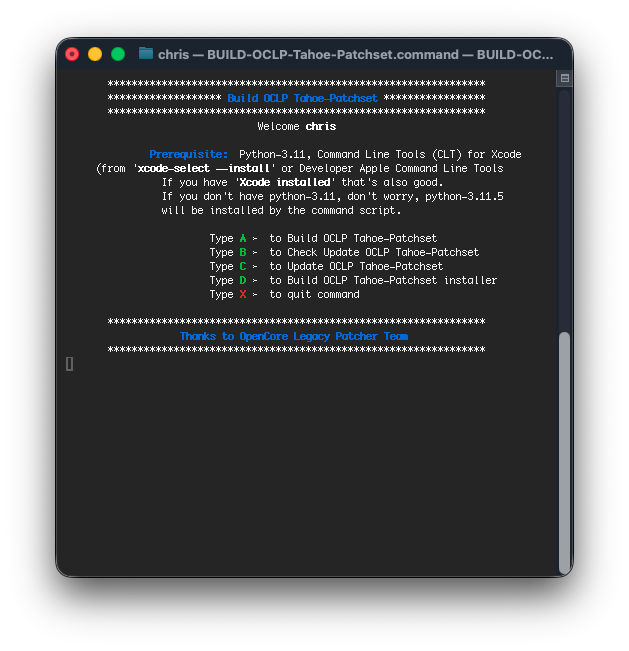

# Build and Run from Source
## Prerequisite: ⬇︎ 
##### Python-3.11, Command Line Tools (CLT) for Xcode (from `xcode-select --install` or Developer Apple Command Line Tools
* If you have `Xcode installed` that's also good.
* If you don't have python-3.11, don't worry, python-3.11.5 will be installed by the command script.

View ☞ [BUILD-OCLP-Tahoe-Patchset.command](https://github.com/chris1111/OpenCore-Legacy-Tahoe_Patchset/blob/tahoe-patchset/BUILD-OCLP-Tahoe-Patchset.command)

Download ➦ [BUILD-OCLP-Tahoe-Patchset.zip](https://github.com/chris1111/OpenCore-Legacy-Tahoe_Patchset/raw/refs/heads/tahoe-patchset/BUILD-OCLP-Tahoe-Patchset.zip)

             

  

