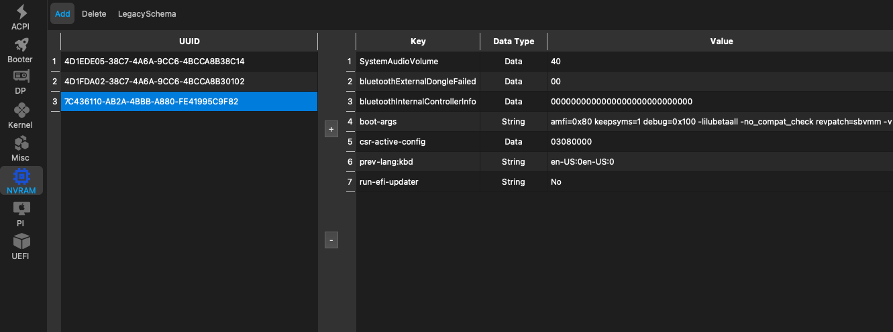

###  Configuration minimal to enable Wifi bluetooth and AppleHDA audio in macOS Tahoe 26
- Testind and Working for a `BCM94360NG Wifi card` and the `Fenvi T919`
- Note: IntelMausi.kext is required because you need working network to download KDK's by OCLP
- Note: On Legacy Wifi you will probably need to activate`AirportBrcmFixup.kext` and the `/Plugins/AirPortBrcmNIC_Injector.kext`

#### config.plist: ⬇︎ 

Kernel Extensions

Kernel Block

NVRAM

  

